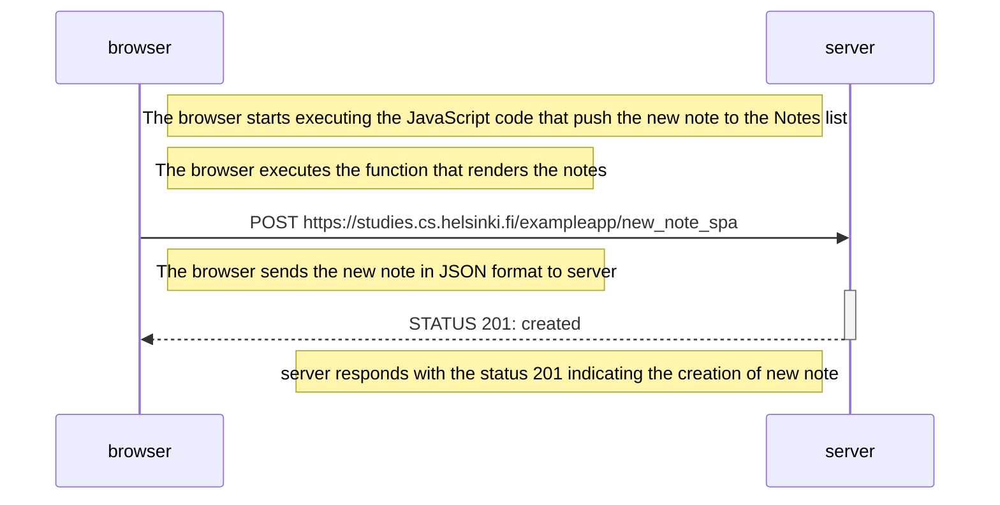

```mermaid

sequenceDiagram
    participant browser
    participant server

    Note right of browser: The browser starts executing the JavaScript code that push the new note to the Notes list 
    Note right of browser: The browser executes the function that renders the notes

    browser->>server: POST https://studies.cs.helsinki.fi/exampleapp/new_note_spa
    
    Note right of browser: The browser sends the new note in JSON format to server   

    activate server
    server-->>browser: STATUS 201: created 
    deactivate server

    Note left of server: server responds with the status 201 indicating the creation of new note
```
